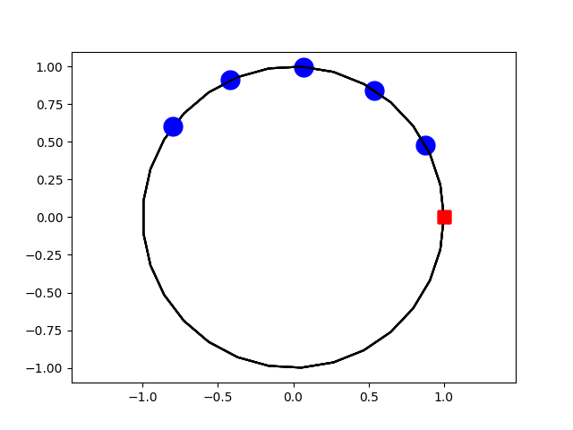

# HW13

Dylan Losey, Virginia Tech.

In this homework assignment we will explore how competitive agents can co-adapt.

## Install and Run

```bash

# Download
git clone https://github.com/vt-hri/HW13.git
cd HW13

# Create and source virtual environment
# If you are using Mac or Conda, modify these two lines as shown in [HW0](https://github.com/vt-hri/HW0)
# If you have previously created a virtual environment with torch, you can just source that environment
python3 -m venv venv
source venv/bin/activate

# Install dependencies
# If you are using Mac or Conda, modify this line as shown in [HW0](https://github.com/vt-hri/HW0)
pip install numpy matplotlib

# Run the script
python main.py
```
## Expected Output



## Assignment

You are given the code for a simplified autonomous car and human driver.
We want to develop an algorithm that plans the robot's actions using game theory.
Specifically, we will implement Stackelberg Games to reach tractable solutions.
Complete the following steps:

1. Explain the vehicle dynamics. What are actions, and how do these actions cause the vehicles to move?
2. Explain the current cost functions. What is the human optimizing for? What is the robot optimizing for?
3. Run the code and find the optimal human trajectory. How does this trajectory change if the robot changes its initial state or motion?
4. Implement a Stackelberg Game where the robot plays first. Compare your solutions when the robot is trying to help the human (current reward) and when the robot is trying to delay the human (altered reward).
5. Reverse the Stackelberg Game so that the human plays first. How are these solutions different from the solutions for the previous question?